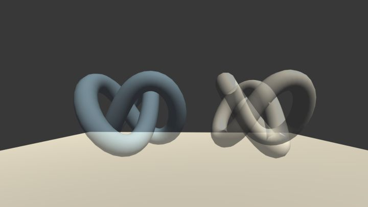
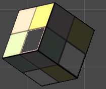
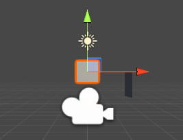
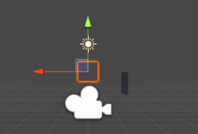

### 不透明物体渲染，需要关闭深度写入的原因

[半透明物体互相交叉]: https://github.com/candycat1992/Unity_Shaders_Book/issues/153

* 传统的半透明混合总是会在物体交叉、渲染重叠的情况下，出现错误的混合效果。如果开启深度写入，会令到渲染错误很明显，而关掉的话影响较小一点


### 开启深度写入的半透明效果

[为什么半透明模型的渲染要使用深度测试而关闭深度写入]: https://www.zhihu.com/question/60898307

* 深度测试的意义在于舍弃片元与否。

* 深度写入的意义在于深度测试的基础上，要不要覆盖深度缓冲，即重新设立深度测试的标准。

* 对于半透明的渲染， 是可以同时开启深度测试和深度写入的。方法是使用2个Pass。一个先只负责保证像素级片元深度正确，一个负责渲染 (左边)

* 如果没有配合深度写入来保证像素级的深度关系 （右边，关闭深度写入,直接透明混合）

   


### Aplha 透明度测试

* 透明度边界处有锯齿，所以透明效果在边缘处参差不齐，因为边界处纹理的透明度的变化精度问题




### 复杂遮挡关系的模型 使用 开启深度写入的半透明效果

* 开启深度写入的半透明效果: 第一打开深度写入 关闭颜色写入ColorMask 0 ; 第二次关闭深度写入 打开颜色写入 

* 这样可以处理 模型本身有复杂的遮挡关系，或者包含复杂的非凸网络的时候

* 因为在cpu端，无法对模型进行像素级排序

* 在unity中，可以不自己写shader来实现模型深度写入，SubShader会一个个Pass执行

  ```
  		Pass
  		{
  			ZWrite On
  			ColorMask 0  // ColorMask A | RGB | 0 
  			// 不需要shader去做片元着色 只是写入深度信息
  		} 
  		Pass
  		{
               Tags 
  			{
  				"LightMode" = "ForwardBase"
  			}
  			ZWrite Off
  			ColorMask RGBA
  			Blend SrcAlpha OneMinusSrcAlpha
  			
  			CGPROGRAM
  			..... 片元和顶点着色器 
  			ENDCG
  			
  		}
  ```


### 面剔除

* [面剔除 Face culling]: https://learnopengl-cn.readthedocs.io/zh/latest/04%20Advanced%20OpenGL/04%20Face%20culling/

* 三个设置

  * 设置正面是逆时针 ( 默认 glFrontFace(GL_CCW); ) ，还是顺时针( GL_CW )，
  * 剔除正面还是反面 (  glCullFace(GL_BACK);  ) 
  * 开关面剔除 glEnable( GL_CULL_FACE );  默认关闭 

* Unity3d 中 Quad 是一个平面正方形 ，Unity在默认情况下渲染引擎剔除了物体背面，如果Quad能够在Scene场景被看到，应该是一个内部有颜色的正方形，如果对着” Scene场景摄像机” 是 Quad的背面的话，点击Quad物体，看到只是一个框

* Unity3d 区别与OpenGL 

  * 默认背面剔除
  * 默认是顺时针表示正面，逆时针表示背面





### Unity3d 摄像机

* 摄像机沿着自己的z轴旋转，不会影响场景中物体/三角形在镜头前的正面和背(现实世界也是，旋转手机不会导致前方物体的朝着摄像机的一面发生变化)

* 每个摄像机可以设置不同的Target Display，在GameView中可以选择不同的Display，从而可以看到不同摄像机的画面

* 留意摄像机的z轴方向是对应世界坐标系中的那个轴

  

### Unity3D 旋转正方向

* 旋转正方向是左手螺旋法则


### 总结

* 透明度双面渲染---- 先后分别打开cull front和cull back 面剔除 后渲染个一次 ---- 应用于，显示透明物体内部
* 打开深度写入的半透明效果--- 先关闭colormask写入打开深度写入，渲染一次模型后，再打开color写入关闭深度写入但保持深度检测，再渲染一次模型----- 应用于，模型本身有复杂遮挡关系


### RenderType和Queue的作用

[UnityShader RenderType&amp;Queue 理解]: https://blog.csdn.net/u013477973/article/details/80607989

```
Camera.SetReplacementShader("shader1","RenderType") 

首先在场景中找到标签中包含该字符串（这里为"RenderType"）的shader，

再去看具有""RenderType"标签的shader，其"RenderType"的值（比如TransparentCutOut,Opaque,Transparent）然后去shader1中查找与"RenderType"的值一样的subShader进行替换 

```

* RenderType 内置值

```
Opaque: 用于大多数着色器（法线着色器、自发光着色器、反射着色器以及地形的着色器）。
Transparent:用于半透明着色器（透明着色器、粒子着色器、字体着色器、地形额外通道的着色器）。
TransparentCutout: 蒙皮透明着色器（Transparent Cutout，两个通道的植被着色器）。
Background: Skybox shaders. 天空盒着色器。
Overlay: GUITexture, Halo, Flare shaders. 光晕着色器、闪光着色器。
TreeOpaque: terrain engine tree bark. 地形引擎中的树皮。
TreeTransparentCutout: terrain engine tree leaves. 地形引擎中的树叶。
TreeBillboard: terrain engine billboarded trees. 地形引擎中的广告牌树。
Grass: terrain engine grass. 地形引擎中的草。
GrassBillboard: terrain engine billboarded grass. 地形引擎何中的广告牌草。
```


### 渲染路径

* 光源的类型: 平行光 点光源 聚光灯 面光源(烘焙)

* 光源的属性: 颜色 强度 衰减 位置 方向 

* 渲染路径: SubShader.Tags.LightMode

  * 向前渲染  
    * ForwardBase  只有一个逐像素的是平行光 + 所有逐顶点+所有SH(球谐函数)光源 
    * ForwardAdd   其他逐像素的光源(会影响物体) 每个光源执行一遍Pass
  * 延迟渲染
    * Defered		 需要支持MRT(多渲染目标)
  * 顶点照明渲染
    * Vertex		最快的渲染路径,计算所有光源对物体的照明,逐顶点处理 目前作为遗留路径

* 向前渲染光源的处理方式(光源照亮物体的方式)：

  * 场景中会有很多光源，对于向前渲染路径，unity会把光源分类，分类是区分每个光源照亮物体的方式，可以是逐顶点，逐像素，SH方式

  * 依据

    * 光源的类型
    * 光源的渲染模式(important，not-important)

  * 光源分类

    * (对物体?平行光不计算衰减?因为没有位置属性?)最亮的平行光 逐像素处理 -- ForwardBase?ForwardAdd?
    * Not Important 的光源  逐顶点或者SH光源 ---ForwardBase
    * Import的光源  逐像素
    * 根据1,3得到的逐像素光源数量少于Quality Settings中逐像素光源数量 就会有更多光源以逐像素方式
    * 一定数量的光源会按照'逐像素'处理
      最多4个光源按照'逐顶点'处理
      剩下按照'SH方式'处理 

  * Shader中应该提供 逐像素或者逐顶点 的SubShader ??

    * ForwardBase的SubSharder 可以逐像素  包含其他逐顶点 和 SH
    * ForwardAdd的SubSharder  只是逐像素 
    * ?? 对于分配到 逐顶点 处理  的光源，会走 RenderType是ForwardBase的SubSharder

  * 编译指令 

    ```
    #pragma multi_compile_fwdbase 
    #pragma multi_compile_fwdadd 
    ```

    * 保证在shader中使用光照衰减等内置光照变量，会被正确赋值

  * “向前渲染”的内置变量和函数

    | 内置变量名                                              | 类型     | 描述                                                         |
    | ------------------------------------------------------- | -------- | ------------------------------------------------------------ |
    | _LightColor0                                            | float4   | 该Pass处理的逐像素光源的颜色                                 |
    | _WorldSpaceLightPos0                                    | float4   | _WorldSpaceLightPos0.xyz是该Pass处理的逐像素光源的位置，.z = 0  平行光   .z !=0 其他光源类型 |
    | _LightMatrix0                                           | float4x4 | 从世界空间到光源空间，光强衰减纹理                           |
    | unity_4LightPosX0, unity_4LightPosY0, unity_4LightPosZ0 | float4   | 仅用于Base Pass 前4个非重要点光源 在世界空间坐标             |
    | unity_4LightAtten0                                      | float4   | 仅用于Base Pass 前4个非重要点光源 衰减因子                   |
    | unity_LightColor                                        | half4[4] | 仅用于Base Pass 前4个非重要点光源 颜色                       |

    | 内置函数名字                             | 描述                                                         |
    | ---------------------------------------- | ------------------------------------------------------------ |
    | float3 WorldSpaceLightDir(float4 v)      | 仅用于向前渲染，输入模型空间中的顶点位置，输出世界空间中，该点到光源的光照方向 |
    | float3 UnityWorldSpaceLightDir(float4 v) | 仅用于向前渲染，输入世界空间中的顶点位置，输出世界空间中，该点到光源的光照方向 |
    | float3 ObjSpaceLIghtDir(float4 v)        | 仅用于向前渲染， 输入模型空间中的顶点位置，返回模型空间中，该点的光照方向 |
    | float3 shade4PointLights(..)             | 仅用于向前渲染，计算4个点光源的光照，参数是4个非重要光源(照亮物体方式会分类成逐顶点或者SH)的 位置unity_4LightPosX0 ，颜色 unity_LightColor ，衰减因子 unity_4LightAtten0 |

  * 实例

    * 环境光/自发光，只在 Base Pass片元中 计算一次  Addtional Pass不作计算
    * Bass Pass 中处理最重要的平行光 ；如果场景中有多个平行光，unity会选择最亮的给到BassPass做逐像素处理，其他平行光会按照在Bass Pass逐顶点或在Additional Pass 中逐像素处理。如果场景中没有任何平行光，那么Bass Pass会当做全黑的光源处理。对于Base Pass来说，逐像素处理的一定是平行光

    

    

    

    

    